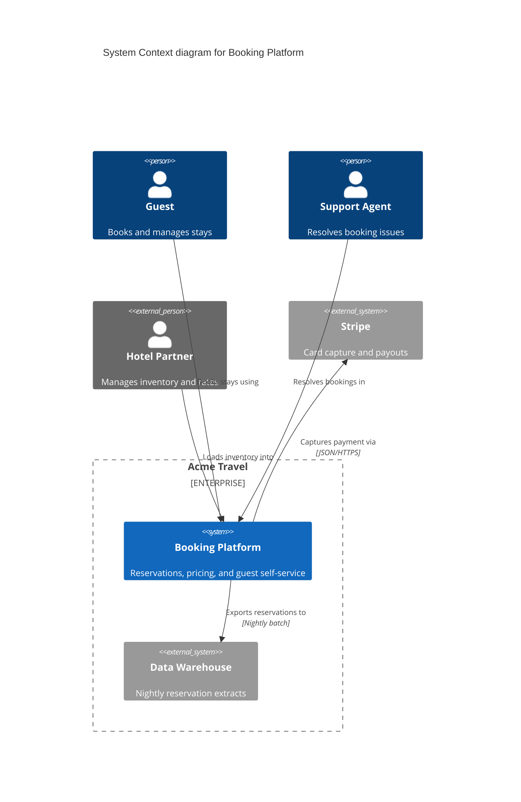
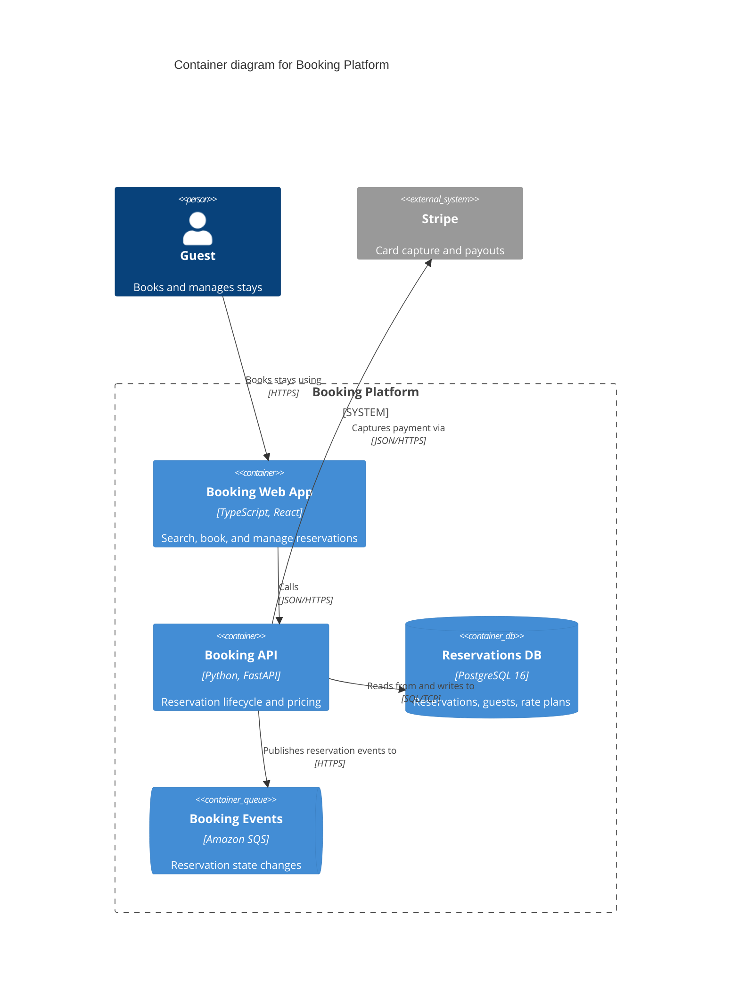
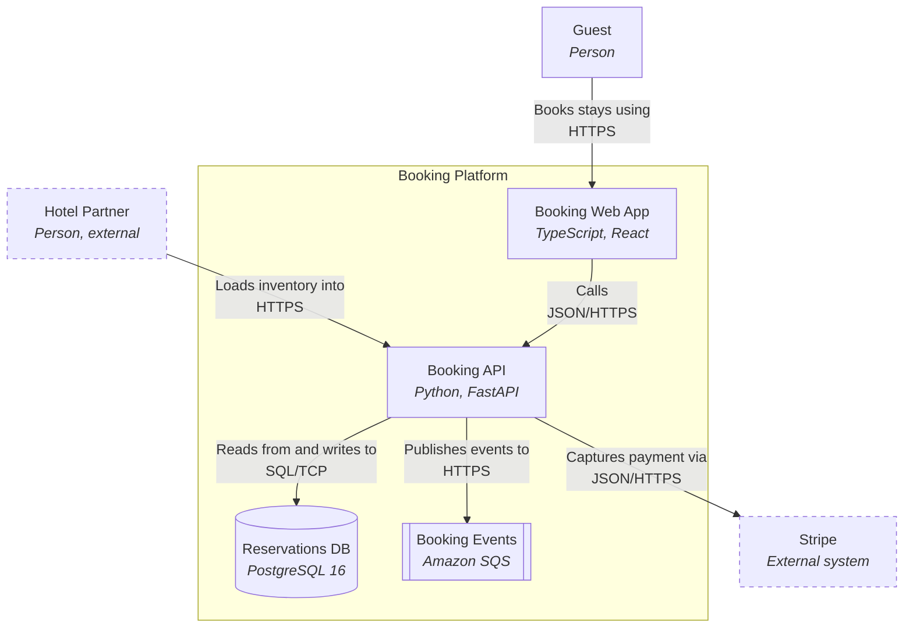

# Rendering

Every snippet below was validated against the Mermaid Chart renderer on 2026-08-02 and returned `valid: true`. That is the current Mermaid engine — **not** GitHub's, which lags by versions. Target the renderer the reader will actually use, and check there before shipping.

## Choosing the syntax

| Situation                                                              | Use                                         |
| ---------------------------------------------------------------------- | ------------------------------------------- |
| Renderer is current Mermaid and C4 semantics matter                    | `C4Context` / `C4Container` / `C4Component` |
| Must render in a GitHub README or an unknown viewer                    | `flowchart` fallback                        |
| Stakeholder-facing, will be edited by hand, needs to survive a meeting | `duet:excalidraw`                           |

Mermaid's C4 support is **experimental** by Mermaid's own documentation, and layout control is limited — you get `UpdateLayoutConfig` and per-relationship offsets, not real positioning. When a diagram has to look a specific way, the flowchart fallback gives more control and the Excalidraw path gives full control.

## C4 element vocabulary

| Element                                              | Use for                                          |
| ---------------------------------------------------- | ------------------------------------------------ |
| `Person(id, "Name", "Description")`                  | A human role inside your organization            |
| `Person_Ext(...)`                                    | A human role outside it                          |
| `System(id, "Name", "Description")`                  | The system under description, or one you own     |
| `System_Ext(...)`                                    | A system someone else owns                       |
| `Container(id, "Name", "Technology", "Description")` | A deployable or runnable unit                    |
| `ContainerDb(...)`                                   | A datastore                                      |
| `ContainerQueue(...)`                                | A broker or queue                                |
| `Component(id, "Name", "Technology", "Description")` | A grouping inside one container                  |
| `Enterprise_Boundary(id, "Name") { }`                | Organizational ownership boundary                |
| `System_Boundary(id, "Name") { }`                    | The system boundary at container level           |
| `Container_Boundary(id, "Name") { }`                 | The container boundary at component level        |
| `Rel(from, to, "Verb phrase", "Protocol")`           | A relationship; fourth argument is the mechanism |

`Rel_U` / `Rel_D` / `Rel_L` / `Rel_R` nudge direction. `UpdateRelStyle(from, to, $offsetX="10", $offsetY="-20")` moves a label off a collision.

## Level 1 · Context

Note the support agent and the warehouse. Those are the actors level 1 diagrams usually omit.

## Level 2 · Containers

Every container carries its technology; every relationship carries a verb and a protocol.

## Fallback · Flowchart

Renders anywhere Mermaid renders at all, including older GitHub. Boundaries become `subgraph`, datastores use the cylinder shape, queues use the subroutine shape, and external things get a dashed stroke.

The fallback loses C4's semantics — nothing enforces that a box is a container rather than a class — so the level discipline moves from the syntax into your head. Keep the title stating the level.

## Layout

- `flowchart TB` stacks vertically and stays readable in a narrow column; `LR` runs wide fast. Prefer `TB` for anything embedded in a document.
- Trim labels hard. One line of identity, one line of technology. A paragraph inside a box is a paragraph that belongs in the prose beside it.
- If the diagram needs manual layout surgery to be legible, it has too many boxes. Split it by level instead.
